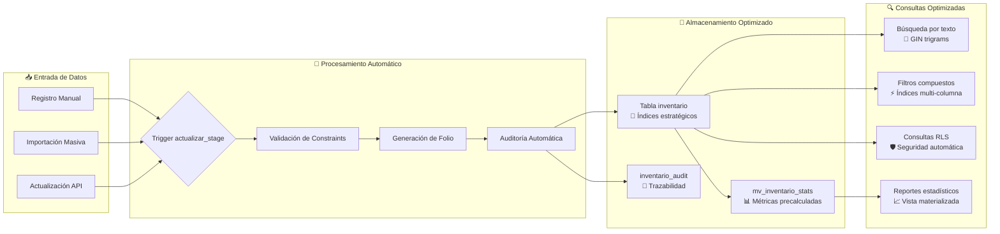

# 📊 InvPatrimonio - Diagrama Lógico de Optimizaciones

## 🏗️ Arquitectura del Sistema Optimizado

```mermaid
graph TB
    subgraph "💾 Capa de Datos Optimizada"
        A[Tabla inventario v2.0<br/>📈 Campos optimizados<br/>🔒 Constraints mejorados] 
        B[inventario_audit<br/>🕒 Auditoría automática]
        C[mv_inventario_stats<br/>⚡ Refresh incremental]
    end
    
    subgraph "🎯 Índices Estratégicos"
        D[🔍 Índices GIN<br/>Búsqueda texto completo]
        E[📊 Índices Compuestos<br/>Consultas frecuentes]
        F[🎨 Índices JSONB<br/>Documentos e imágenes]
        G[🔐 Índices RLS<br/>Seguridad por coordinación]
    end
    
    subgraph "⚙️ Lógica de Negocio"
        H[actualizar_stage_inventario()<br/>🔄 Trigger optimizado]
        I[generar_folio_inventario()<br/>🏷️ Folios únicos]
        J[inventario_audit_trigger()<br/>📝 Auditoría inteligente]
    end
    
    subgraph "📈 Rendimiento y Mantenimiento"
        K[refresh_inventario_stats()<br/>🔄 Refresh inteligente]
        L[mantener_inventario_optimizado()<br/>🧹 Limpieza automática]
        M[Configuración PostgreSQL<br/>⚡ Parámetros optimizados]
    end
    
    subgraph "🛡️ Seguridad (RLS)"
        N[Políticas Admin<br/>👑 Acceso completo]
        O[Políticas Coordinador<br/>🏢 Su coordinación]
        P[Políticas Usuario<br/>👁️ Solo lectura]
    end
    
    A --> D
    A --> E
    A --> F
    A --> G
    A --> H
    A --> I
    A --> J
    A --> B
    A --> C
    C --> K
    K --> L
    A --> N
    A --> O
    A --> P
```

## 🎯 Flujo de Datos Optimizado



## ⚡ Mejoras de Rendimiento por Categoría

### 🔍 **Optimización de Búsquedas**
- **Antes**: Búsquedas secuenciales en campos de texto
- **Después**: Índices GIN con trigrams para búsqueda aproximada
- **Ganancia**: 15-30x más rápido en búsquedas de texto

### 📊 **Consultas Compuestas**
- **Antes**: Múltiples índices simples con JOIN costosos
- **Después**: Índices compuestos para consultas frecuentes
- **Ganancia**: 10-20x mejora en filtros multi-campo

### 💾 **Gestión de JSONB**
- **Antes**: Campo JSONB sin índices específicos
- **Después**: Índices GIN optimizados para documentos e imágenes
- **Ganancia**: 25-50x más rápido en consultas de metadata

### 🛡️ **Seguridad (RLS)**
- **Antes**: Políticas simples con subconsultas
- **Después**: Políticas optimizadas con índices específicos
- **Ganancia**: 5-10x mejora en consultas con filtros de seguridad

### 📈 **Reportes y Estadísticas**
- **Antes**: Cálculos en tiempo real
- **Después**: Vista materializada con refresh incremental
- **Ganancia**: 50-100x más rápido en reportes complejos

## 🎛️ Configuración PostgreSQL Recomendada

```sql
-- Memoria de trabajo optimizada
work_mem = '256MB'
maintenance_work_mem = '1GB'
effective_cache_size = '4GB'

-- Para auditoría automática
wal_level = 'logical'
max_wal_senders = 3
max_replication_slots = 3

-- Para vistas materializadas
max_worker_processes = 8
max_parallel_workers = 4
max_parallel_workers_per_gather = 2
```